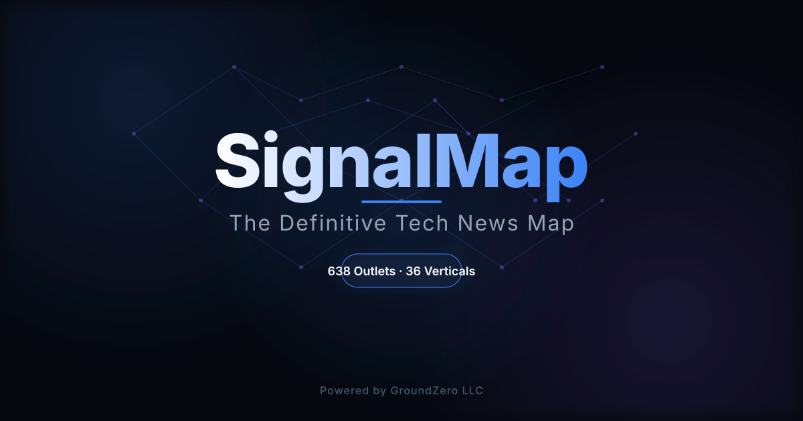

# SignalMap
### Intelligence. Curation. Density.

**The definitive signal-to-noise filter for the technology frontier.**

[Explore the Directory →](https://oke3.github.io/SignalMap/)

---

## ⚡ The Thesis
Information is abundant; intelligence is scarce. SignalMap is not a list—it is a high-fidelity map of the global tech news ecosystem. We eliminate the friction of discovery, providing a curated entry point into the outlets that actually move the needle.

## 📐 The Scale
A meticulously maintained repository of technical authority.
- **611 Curated Outlets**
- **36 Deep-Dive Verticals**
- **Zero Noise.**

## 🧬 Intelligence Categories
The ecosystem is partitioned into six core intelligence domains for rapid navigation:

- **AI & Infrastructure**
- **Security & Data**
- **Consumer & Design**
- **Science & Sustainability**
- **Business & Finance**
- **Policy & Society**

## 🛠️ The Toolset
Built for the power user. Zero friction. Platform agnostic.

- **Advanced Intelligence Filtering**: Real-time search with typeahead, type-based filters (Website, Newsletter, Podcast), and tier sorting (Primary vs. Niche).
- **Serendipity Engine**: The 'Surprise Me' feature for discovering high-value outlets outside your immediate echo chamber.
- **Persistent Context**: Integrated recently viewed tracking and bookmarks for seamless intelligence gathering.
- **Data Portability**: One-click JSON export of filtered data for external analysis.

## 🏗️ The Architecture
Extreme performance is a requirement, not a feature.

- **Framework**: Built with **Astro** for an island-based, zero-JS-by-default architecture.
- **Styling**: Powered by **Tailwind v4** for high-performance, utility-first design.
- **Experience**: A "smooth as fuck" UX designed for maximum density and minimum cognitive load.

## 🛡️ Privacy & Governance
**Private-First.** SignalMap operates as a private repository. Only the final, optimized build is exposed to the public, ensuring the curation process remains an internal, high-fidelity operation.
